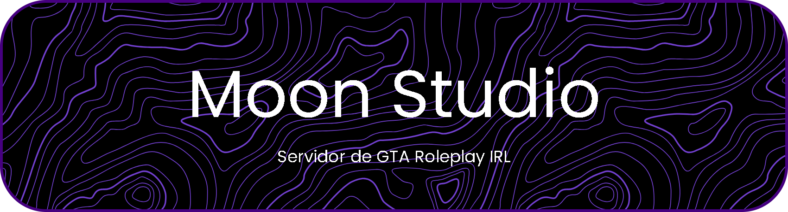

# 🌙 Moon Vision

---

## 🚀 Descripción

**Moon Vision** es un proyecto conceptual de **GTA Roleplay**, donde se documenta y organiza toda la información, ideas y narrativa del universo de juego.  
Este proyecto tiene como objetivo **crear un repositorio centralizado y profesional** de todo el lore, mecánicas, reglas y desarrollo de Moon Studio RP.

---

## 📌 Características principales

- 📝 Documentación completa del proyecto: reglas, lore, historia y roles.  
- 🌐 Organización de contenido en carpetas y archivos estructurados.  
- 📊 Sistema de badges y estadísticas para monitorear el desarrollo del repositorio.  
- 💡 Facilita la colaboración y futuras expansiones del universo Moon Studio RP.

---

## 🌱 Próximos pasos

- Agregar **guías de rol avanzadas** y ejemplos prácticos.  
- Documentar **eventos y misiones** dentro del servidor.  
- Integrar **badges de GitHub y estadísticas en tiempo real** para seguimiento.  
- Publicar recursos multimedia con licencia **Creative Commons BY-NC 4.0**.

---

## 📫 Contacto

- ✉️ Email: moonvisionrp@protonmail.com 
- 🌐 Discord: [Click Aquí](https://discord.gg/HtJ8uMQBed)  
- 🐙 GitHub: [cristianquerolalves1](https://github.com/cristianquerolalves1/)

---

## ⚡ Dato curioso

Este proyecto busca **centralizar todo el universo creativo de Moon Studio RP**, haciendo que cualquier colaborador pueda acceder fácilmente a la información y contribuir de manera organizada y profesional.

---

## 🔗 Licencia

Este proyecto está bajo la licencia **[Creative Commons BY-NC 4.0](https://creativecommons.org/licenses/by-nc/4.0/)**.  
Puedes **compartir y adaptar el contenido**, pero **no para fines comerciales** y siempre **dando crédito al autor**.
